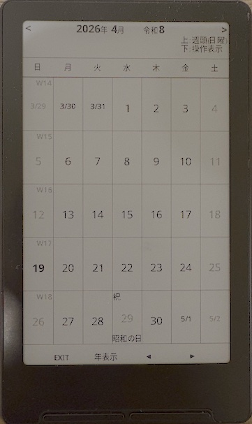
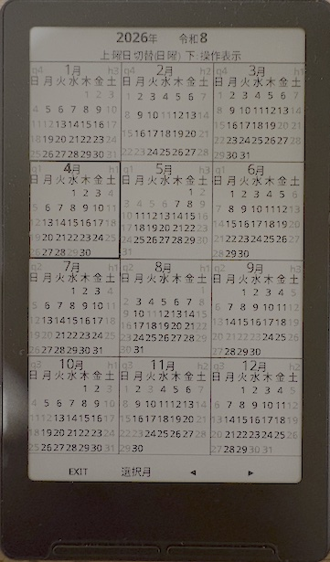

<p align="right">
  <a href="./README.ja.md">🇯🇵 日本語</a>
</p>

# cal-x-j


A Japanese calendar plugin for XTEINK X4

`cal-x-j` is a lightweight Japanese calendar plugin designed for XTEINK X4 running the custom firmware `crosspoint-reader-lua`.

The name comes from `cal` for calendar, `x` for XTEINK X4, and `j` for Japanese.

It runs efficiently on e-ink hardware and supports both year and month views, including Japanese holidays.

## Preview

### Month View


### Year View


## Concept

This project was created to provide a compact calendar that fits in a jacket pocket while commuting and can remain on a desk without concern for battery life.

## Who is this for?

- XTEINK X4 users
- Anyone looking for a lightweight calendar on e-ink devices
- Users who already have a `crosspoint-reader-lua` environment set up

## Features

- 📅 Switch between month view and year view
- 🇯🇵 Shows Japanese holidays
- 🗂 Visualizes quarters and monthly holiday counts in year view (toggleable)
- 🔢 Shows week numbers in month view (toggleable)
- 💾 Saves display settings automatically
- ⚡ Lightweight Lua implementation for low-resource environments

## Installation

0. Install `crosspoint-reader-lua` on XTEINK X4 and configure Japanese fonts to enable a Japanese environment.
   - Official: https://github.com/ideo2004-afk/crosspoint-reader-lua

1. Clone or download this `cal-x-j` repository.
2. Place the plugin folder as follows:

Example SD card layout:

```
/sdcard/
 ├─ plugins/
 │   └─ cal-x-j/
 │       ├─ main.lua
 │       └─ settings.txt
```

3. Start XTEINK X4 and enable the plugin.

## Japanese font support

`cal-x-j` runs on XTEINK X4 using the `crosspoint-reader-lua` custom firmware. To use a custom CJK font, convert it to `.bin` format using the official font converter and place it under `/fonts/` on the SD card.

> Dependency: https://github.com/ideo2004-afk/crosspoint-reader-lua

### Official font conversion

- Official converter script: `tools/crosspoint-reader-lua/CJK-font-converter/convert_font.py`
- Example:

```sh
python3 /path/to/CJK-font-converter/convert_font.py  --font ./16_NotoSansJP/NotoSansJP-Medium.otf --size 18 --output /path/to/sdcard/fonts/NotoSansJP-Medium_18_18x27.bin
```
### Font placement

1. Copy the generated `.bin` file to `/fonts/` on the SD card.
2. If XTEINK X4 supports external font selection, the generated font will be available.

> Example: `/sdcard/fonts/NotoSansJP-Medium_18_18x27.bin`

## Usage

- ← / → : Change month
- ↑ : Toggle week start day
- ↓ : Toggle hints on/off
- OK : Switch between year and month views
- BACK : Exit

## Configuration

The file `/path/to/sdcard/plugins/cal-x-j/settings.txt` stores the following settings.

- showHints (bool) : Show hints
- showQuarter (bool) : Show quarter labels in year view
- showHolidayCount (bool) : Show holiday counts in year view
- showWeekNumber (bool) : Show week numbers in month view
- startDow (int) : Week start day (0 = Sunday, 1 = Monday)
- viewMode (string) : `month` or `year`
- viewYear (int) : Display year
- viewMonth (int) : Display month
- selMonth (int) : Selected month in year view

### Example `settings.txt`
```txt
showHints=true
showQuarter=true
showHolidayCount=false
showWeekNumber=true
startDow=0
viewMode=month
viewYear=2026
viewMonth=4
selMonth=4
```

## Development

### Requirements

- Lua 5.3+

## File structure

- `main.lua` - Plugin entry point
- `LICENSE` - MIT License

## License

This project is licensed under the MIT License - see the LICENSE file for details.

## Author

[`mi-ak`](https://github.com/mi-ak)
